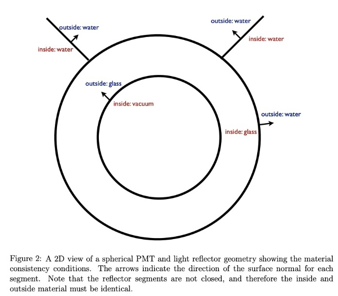

# Chroma-LXE

Chroma-LXE provides a set of tools for modeling and analyzing the behavior of photons in liquid xenon detectors using [chroma](https://github.com/benland100/chroma) simulation framework. It includes:

- Scaffolding for defining custom geometries and materials.
- Tools to create, save, and use light maps in the detector
- Utilities for visualizing the detector geometry and photon trajectories.
- A collection of Jupyter Notebooks demonstrating how to use the toolkit.

`chroma-lxe` allows for the simulation of complex geometries with arbitrary detector configurations, materials, and surfaces using the [chroma](https://github.com/benland100/chroma) simulation framework, a CUDA-based fast optical propagator with relevant physics processes. From the original repo,

>Chroma is a high performance optical photon simulation for particle physics detectors originally written by A. LaTorre and S. Seibert. It tracks individual photons passing through a triangle-mesh detector geometry, simulating standard physics processes like diffuse and specular reflections, refraction, Rayleigh scattering and absorption.
>
>With the assistance of a CUDA-enabled GPU, Chroma can propagate 2.5 million photons per second in a detector with 29,000 photomultiplier tubes. This is 200x faster than the same simulation with GEANT4.

`chroma` requires a CUDA-enabled GPU to work. To check if your GPU is CUDA-enabled, you can use the [CUDA GPU Checker](https://developer.nvidia.com/cuda-gpus).

## Table of Contents

- [Installation](#installation)
- [Usage](#usage)
- [Repository Structure](#repository-structure)

### Installing chroma

`chroma` is easiest to run in a container, where all nontrivial dependencies are already installed and ready to use. You can use [Docker](https://www.docker.com/resources/what-container/) or [Apptainer (formerly Singularity)](https://apptainer.org/docs/user/latest/). Either works, but the Apptainer/Singularity container is the recommended way to run chroma because of its ease of binding directories and GPU synchronization. Either way, you will need to install Docker as the Singularity container is built from a Docker image.

<details><summary>Running with Docker</summary>

Before running, ensure that you have installed the NVIDIA Container Toolkit. You can find instructions [here](https://docs.nvidia.com/datacenter/cloud-native/container-toolkit/latest/install-guide.html). Ensure everything's working by running `sudo docker run --rm --runtime=nvidia --gpus all ubuntu nvidia-smi` and checking that the output is as expected.

You can run the pre-built Docker container with the following command:

```bash
sudo docker run --runtime=nvidia --gpus all -v $HOME:$HOME -it youngsm/chroma3:lxe-plib
```

The `-v $HOME:$HOME` flag mounts your home directory inside the container, allowing you to access files on your host machine. The `youngsm/chroma3:lxe-plib` image is the latest version of the container with the necessary dependencies for TPC studies found in chroma-lxe.
</details>

<details><summary><b>(Recommended)</b> Running with Apptainer (Singularity)</summary>

To run the container with Singularity, you will need to install Singularity on your machine and build an image to run. To build the image, run the following command:

```bash
sudo singularity build chroma3.simg docker://youngsm/chroma3:lxe-plib
```
(For Gratta lab members, the container is already built and available on the PC and is found in `/proj/common/sw/chroma3.simg`)

To run the container, use the following command:

```bash
singularity run -B /run/user --nv /path/to/chroma3.simg
```

</details>

### Setting up `chroma-lxe` for use.

Install chroma-lxe by following the instructions below.

```bash
# Clone the repository
git clone https://github.com/youngsm/chroma-lxe.git
# Set up the environment
source chroma-lxe/env.sh
# Add the environment setup to your bashrc (optional)
echo "source $PWD/chroma-lxe/env.sh" >> ~/.bashrc
```

Test that the installation was successful by running the following command and ensuring that it runs without errors:

```bash
python -m geometry.fiber
```

Note that `env.sh` adds the `chroma-lxe` directory to your `PYTHONPATH`. This allows you to import the modules from the repository in your scripts.

## Repository Structure

- `bin/`: Contains executable scripts.
- `data/`: Stores input data for simulations. Think STL files, lightmap coordinates, light spectra, etc.
- `geometry/`: Defines geometrical configurations for the simulations. 
    - `builder.py`: Code for building a detector geometry from YAML-based configuration files. `build_detector_from_yaml` is the main function here.
    - `fiber.py`: Classes for defining optical fiber sources. 
    - `materials.py`, `surfaces.py`: Definitions for materials and surfaces. Materials and surfaces used in detector definitions must be defined here.
- `installation/`: Instructions and scripts for setting up the environment.
- `macros/`: Macro files for batch processing.
    - `config_from_stl.py`: Macro that generates a template detector definition YAML file from a list of STL files. 
    - `nphoton_scan.py`: Macro that creates a light map for a detector configuration by scanning over many positions and simulating photon bombs.
    - `h5_to_plib.py`: Macro that converts a HDF5 file outputted by `nphoton_scan.py` to a photonlib file for ease of use. See [notebooks/hv_lightmap.ipynb](notebooks/hv_lightmap.ipynb) for an example of how to use photonlib files.
    - `hv.py`: Macro showing fiber optic light source simulation in the high voltage setup at the Gratta lab.
    - `sample_sim.py`: Sample barebones simulation file for you to modify.

- `notebooks/`: Jupyter Notebooks demonstrating usage and examples.
    - `generate_positions.ipynb`: Demonstrates how to use `trimesh` to generate lightmap positions within a detector.
    - `hv_lightmap.ipynb`: Demonstrates how to interact with a photonlib file and visualize the lightmap.
    - `hv_events.ipynb`: Demonstrates how to use the `chroma`-generated ROOT output files to visualize PTE on a 3D mesh.
    - `segment_electrode.ipynb`: Notebook used to segment a single STL file containing an electrode into many smaller STL files to see the position-based response of the detector.
    - `materials_checker.ipynb`: Notebook for visualizing what chroma will think is `material1` (inner material, red) and `material2` (outer material, blue) if you were to use a specific STL.

## How simulation and analysis works

> These notes are adapted from notes provided by Ben Land.

This repository uses a python-based simulation and analysis framework, [`pyrat`](pyrat), first developed by Ben Land at UPenn. The `pyrat` file is ran in conjunction with a _macro_, which is a python script that defines methods that pyrat will run at different stages of the simulation. Example usage:

```bash
pyrat macros/sample_sim.py --output test_output.root --evalset num_photons 1000
```

This command will run the `sample_sim.py` macro, outputting the results to `test_output.root`, and setting `db.num_photons`, the number of photons in each photon bomb, to 1000 instead of the default value used in `__configure__`.

### Macros

The macro is responsible for setting up the simulation, running the simulation, and analyzing the output. An example macro is found in `macros/sample_sim.py`.

* `__configure__(db)` is called once when the macro is loaded to add or modify fields in the database. This happens after any `--db` packages specified at runtime are loaded, but before any `--set` or `--evalset` options are evaluated. Returns nothing. Optional.

* `__define_geometry__(db)` is called once after `__configure__` and should return a Chroma geometry (pyrat will flatten and build the BVH) if a simulation is to be performed. If the result is None or this method does not exist, pyrat will not run a Chroma simulation, and will assume you are running an analysis over existing data. Optional.

* `__event_generator__(db)` should be a [python generator](https://wiki.python.org/moin/Generators) that yields something Chroma can simulate (`chroma.event.Event`, `chroma.event.Vertex`, or `chroma.event.Photons`) if running a simulation, or anything you want passed to `__process_event__` during an analysis.

* `__simulation_start__(db)` and `__simulation_end__(db)` are called before and after the event loop, which iterates over the event generator and calls `__process_event__` for each event.

* `__process_event__(db,ev)` receives the events from the event generator as they are generated. If a simulation is being performed, these will be Chroma `chroma.event.Event` objects post-simulation.

### Input/output

Macros are allowed to define any form of input/output they desire. It is suggested to use simple datastructures to store analysis results. Chroma defines a ROOT datastructure that stores all relevant Chroma event properties, and should be used for that purpose. Reading is done similarly. To save each event using this datastructure, add the `--output` flag to the pyrat command line arugments.

```bash
pyrat /path/to/macro.py --output /path/to/output.root
```

Similarly, if you already have a ROOT file with Chroma events that you want to re-analyze, you can use the `--input` flag.

```bash
pyrat /path/to/macro.py --input /path/to/input.root
```

### Databases (`db`)

The `database` module contains code to allow a python package (or module) to 
define a database that maps string keys to arbitrary values like a python 
dictionary. 

Each module in the package can define a property `__exports__` which should be
a list of variable names in the module to add to the database. 

Any module can define an `__opt_exports__` function which will be passed a 
dictionary of run-dependent options and can return a dictionary of keys and 
values to add to a database.

A database can be used like a standard python dictionary: `value = db[key]`.
It can also access string keys that are valid python variable names as fields
of the database object: `value = db.key`.

The `data` package contains default pyrat paramters and is self-documenting. 
For instance, see `data.chroma` for parameters that control the `Chroma` 
simulation. Macros can `__configure__` the database to add or modify fields, 
and load additional properties. The pyrat executable defines `--set` and 
`--evalset` options which set strings or python values (i.e., evaluated) to database keys. These are done in the order they are described, so runtime sets take precedence.

### Geometry

Chroma uses a geometry defined using double-sided triangles. A triangle's physical properties is fully defined by it's _inside_ material, _outside_ material, and a surface material. 

#### Material considerations

The **inside (`material1`) and outside (`material2`) materials** identify the bulk properties of the two media the boundary separates.
* E.g., index of refraction and absorption lengths. See [`geometry/materials.py`](geometry/materials.py).

The **surface material** describes the optical properties of the surface
* E.g., diffuse and specular reflectivity, detection efficiency. See [`geometry/surfaces.py`](geometry/surfaces.py).

<p align="center">

</p>

Above is an example of the sort of materials you'd want to use for a spherical pmt + reflector submerged in water (a la SNO), taken from the Chroma whitepaper.

The orientation of a triangle is found by using the right hand rule on the triangle vertices in the order in which they are defined. This normal is defined as the direction of the inside material. 

<p align="center">

</p>

This is extremely important when defining the geometry of your detector, as the orientation of the triangles will determine the direction of the inside material. If you switch your inside and outside materials, Chroma might think that your detector volume is solid stainless steel and not liquid xenon.

To check which material Chroma thinks is the inside and outside material, you can use the [`materials_checker.ipynb`](notebooks/materials_checker.ipynb) notebook or [`materials_checker.py`](macros/materials_checker.py) macro. This notebook will show you a visualization of the inside and outside materials based on the orientation of the triangles in a STL file by plotting two copies of the detector, one unchanged in yellow (the inner material) and one "exploded" view in green (the outer material). In most cases, the STL is correctly defined such that the inside material (yellow) is the the solid material (like SS) and the outside material (green) is the detector medium (like LXe). See example from the notebook below:

<p align="center">


</p>

From this STL we see that the inside material (yellow) is stainless steel and the outside material (green) would be liquid xenon. So in the detector definition for the part using this STL we'd write

```yaml
...
material:
  material1: steel
  material2: lxe
...
```

#### From CAD to Chroma

Chroma-lxe uses STL files to define the geometry of the detector. Unfortunately there's no easy way to automate this, so there's a bit of manual work involved. The basic idea is that we will need to categorize our detector into different parts based on the material and surface properties we want to assign to them.

For example, for a LXeTPC with SiPMs, you'd want to do something like:
- Save the TPC (including flanges, conflats, spools, screws, etc.) as `tpc.stl` with the idea that we'll just set this whole object to be stainless steel with a liquid xenon inside.
- Save the individual SiPM tiles as `sipms_#.stl` with the idea that each stl will be a single channel with ceramic interior, lxe exterior, and a detecting surface.
- Save the ceramic boad that the SiPMs are glued on as `ceramic_board.stl` with the idea that this will be a ceramic material with a lxe exterior and ceramic surface.
- ... and so on.

Below is the process for creating a detector definition a SolidWorks:

1. Open the CAD file in SolidWorks
2. Select the parts you want to save
3. Right click and select `Invert Selection` 
4. Right click on any of the inverted selection and select `Hide Components` 
5. Click File > Save as > Save as type: STL > Options > Unit: Millimeters > Save all components of an assembly in a single file > OK > Save
6. Repeat steps 2-5 for each part you want to save.

After you have all the STLs you need, you can use the `config_from_stl.py` macro to generate a template detector definition YAML file:

```bash
python -m macros.config_from_stl /path/to/stl_files/*.stl
```

> Note that this macro treats a single STL as a single part. If you want to use multiple STLs as a single part, you will need to manually create a part in the YAML definition and use '*' in the `stl` field to specify multiple STLs. See the `sipm_tiles` part in the [`detector.yaml`](geometry/config/detector.yaml) file for an example of this.

Then, you can finally edit the YAML file to assign the correct materials and surfaces to each part.

#### Defining the detector

A YAML file (an easy to use json-like filetype) is used to define the geometry of the detector. The geometry is defined by a list of _parts_, each of which is a separate STL file(s). Each part can has its own material and surface properties, and can be marked as a detector or not. 

Each part can also be translated and rotated in 3D space. The translation is defined by a 3D vector, and the rotation is defined by an axis of rotation and an angle in degrees. If you used the method above to create your STL files, they should be oriented correctly and you shouldn't need to translate or rotate them.

Each part is assigned a material1 (inner material), material2 (outer material), and surface. The material is defined by the `material1` and `material2` fields, and the surface is defined by the `surface` field. The materials and surfaces must be defined in the `geometry/materials.py` and `geometry/surfaces.py` files, respectively. 

Optionally, you can also color the part by specifying a color and alpha in the `color` and `alpha` fields. The color can be specified as a hex code (e.g., #ffffff), a string (e.g., 'red', 'blue', etc.). All matplotlib colors are available. The alpha is a float between 0 and 1, where 0 is fully transparent and 1 is fully opaque. If color and alpha are not specified, the part will be colored grey with an alpha of 0.25.

At the top of the file, you will need to define a target medium. This is the medium that the detector is submerged in. As a precaution, all parts are encapsulated by a bounding box that is filled with the target medium. This is to ensure that all photons are absorbed by the target medium and not lost to the void. If your detector volume's edge is fully opaque (e.g., steel), this won't matter so you can set this to any material (i.e., `vacuum`).

You can visualize your detector by using `geometry/builder.py`:

```bash
python -m geometry.builder /path/to/detector.yaml
```

This will create a 3D visualization of your detector in a window using Chroma. You can rotate the detector by clicking and dragging, zoom in and out with the scroll wheel, and pan by holding the right mouse button and dragging.

## Contact

For any questions or suggestions, please open an issue in this repository or email me at [youngsam@stanford.edu](mailto:youngsam@stanford.edu). I'm very happy to help.